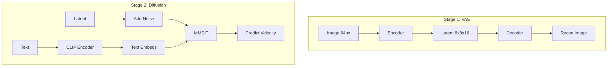

# tiny-stable-diffusion

> **Stable Diffusion 3 from Scratch** - A minimal, educational implementation of modern text-to-image synthesis.

  

A lightweight **200M parameter** implementation of Stable Diffusion 3 (SD3) optimized for consumer GPUs. This project demonstrates the core mechanics of **Rectified Flow** and **MMDiT** architecture by generating **64×64 images**.

---

## 🚀 Quick Start

```bash
# 1. Environment Setup
bash scripts/setup.sh

# 2. Training Sequence (VAE -> Diffusion)
uv run main.py --train-vae
uv run main.py --train-diffusion

# 3. Generate Images
uv run main.py --generate --prompt "a cute cat"
```

---

## 🎨 Visual Demo

Explore the model interactively using the built-in Streamlit dashboard.

### Streamlit Dashboard
| VAE Reconstruction | Diffusion Generation |
|:---:|:---:|
|  |  |
| *Visualizing VAE compression & reconstruction* | *Generating images from text prompts* |

### Sample Outputs
*Settings: `checkpoint=diffusion.pt (40 epochs)`, `steps=50`, `guidance=7.5`*

| Prompt | Result | Prompt | Result |
|:---|:---:|:---|:---:|
| `a fluffy orange cat on a sofa` |  | `a red sports car on a rainy street` |  |
| `a small cabin in snowy mountains` |  | `a sunflower field at sunset` |  |
| `a bowl of ramen on a wooden table` |  | `a futuristic city skyline at night` |  |
| `a corgi wearing sunglasses` |  | `a lighthouse by rough ocean waves` |  |

---

## 🛠 Key Features

- **64×64 Resolution**: Optimized for fast iteration and training on consumer hardware.
- **SD3 Core Components**:
    - **VAE**: AutoencoderKL with f8 compression and 16 latent channels.
    - **MMDiT**: Multi-Modal Diffusion Transformer featuring Joint Attention.
    - **Rectified Flow**: Modern linear interpolation-based diffusion training.
- **Efficient Latent Space**: All diffusion happens in a compressed $8 \times 8 \times 16$ latent space.
- **Educational Design**: Clean, modular PyTorch code with minimal external dependencies.

---

## 📐 Architecture & Pipeline

### 1. Training Workflow
The system follows a two-stage Latent Diffusion Model (LDM) approach.



### 2. Inference Path
`Text Prompt` ──► `CLIP` ──► `MMDiT` ──► `VAE Decoder` ──► `Generated Image`

---

## 💻 Usage

### Environment & Weights
Detailed setup can be found in [`scripts/README.md`](scripts/README.md).

```bash
# Download pretrained checkpoints from Hugging Face
uv run python scripts/download_from_hub.py \
  --repo-id junyeong-nero/tiny-sd-models \
  --model-type all
```

### Inference & Benchmarking
```bash
# Generate image
uv run main.py --generate --prompt "a cosmic nebula" --steps 50

# Run performance benchmark
bash scripts/measure-inference.sh
```

**M2 MacBook Air Performance (`device=mps`):**
- **Speed**: ~1.55 sec/image (10 steps)
- **Peak Accel Memory**: ~1.5 GB

---

## 📊 Model Comparison

| Component | Parameters | Description |
|-----------|------------|-------------|
| **VAE** | ~21M | AutoencoderKL (f8 compression) |
| **MMDiT** | ~187M (Base) | Multi-Modal DiT with Joint Attention |
| **CLIP** | 123M | Frozen ViT-B/32 Text Encoder |

| Feature | Stable Diffusion 3 | tiny-stable-diffusion |
|---|---|---|
| **Resolution** | 1024×1024 | 64×64 |
| **Latent Channels** | 16 | 16 |
| **Model Size** | 2B+ | ~200M |
| **Training Cost** | Multi-GPU Cluster | Single Consumer GPU |

For deep dives, see: [VAE Architecture](docs/models/VAE.md) | [MMDiT Architecture](docs/models/MMDiT.md) | [Diffusion Process](docs/models/Diffusion.md)

---

## 📂 Project Structure

```text
.
├── main.py              # CLI entry point
├── config.yaml          # Hyperparameters & Settings
├── src/
│   ├── models/          # VAE, MMDiT, Layers
│   ├── training/        # Trainers & Loggers
│   ├── inference/       # Image Generation logic
│   └── demo/            # Streamlit Dashboard
├── scripts/             # Utility & Training scripts
└── docs/                # Technical documentation
```

---

## 📜 References & License

- [Stable Diffusion 3 (Scaling Rectified Flow Transformers)](https://arxiv.org/abs/2403.03206)
- [DiT (Scalable Diffusion Models with Transformers)](https://arxiv.org/abs/2212.09748)
- MIT License