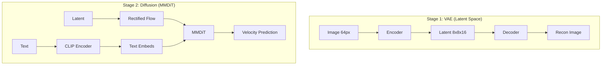

# 🎨 tiny-stable-diffusion

> **Stable Diffusion 3 from Scratch** – A minimal, educational implementation of modern text-to-image synthesis.

[](https://www.python.org/)
[](https://pytorch.org/)
[](LICENSE)

A lightweight **200M parameter** implementation of Stable Diffusion 3 (SD3) optimized for consumer GPUs. This project demonstrates the core mechanics of **Rectified Flow** and **MMDiT** architecture by generating **64×64 images** from scratch.

---

## 🌟 Overview

This project is designed for researchers and enthusiasts who want to understand the inner workings of modern Latent Diffusion Models (LDMs). By focusing on a smaller scale ($64 \times 64$), it allows for complete training and inference cycles on a single consumer-grade GPU or even a modern laptop.

### 🛠 Key Features

- **Scalable Architecture**: Pure PyTorch implementation of the **MMDiT** (Multi-Modal Diffusion Transformer).
- **Modern Training**: Implements **Rectified Flow** for straighter inference paths and faster sampling.
- **Efficient Latent Space**: $8 \times 8 \times 16$ latent compression via a custom-trained **VAE (AutoencoderKL)**.
- **Educational First**: Clean, modular code with minimal dependencies, focusing on readability and logic flow.
- **Ready-to-use**: Includes scripts for training, inference, benchmarking, and a Streamlit-based interactive demo.

---

## 🚀 Quick Start

### 1. Environment Setup
We use `uv` for lightning-fast dependency management.
```bash
# Install dependencies and setup environment
bash scripts/setup.sh
```

### 2. Training Pipeline
The model is trained in two distinct stages:
```bash
# Stage 1: Train the VAE for image compression
uv run main.py --train-vae

# Stage 2: Train the MMDiT for text-conditioned generation
uv run main.py --train-diffusion
```

### 3. Generate Images
```bash
# Generate a single image from a prompt
uv run main.py --generate --prompt "a cute cat in a spaceship"
```

---

## 🎨 Visual Demo

### Interactive Dashboard
Explore the model's capabilities using the built-in Streamlit interface.
```bash
uv run streamlit run src/demo/app.py
```

| VAE Reconstruction | Diffusion Generation |
|:---:|:---:|
|  |  |
| *Visualizing $8 \times 8 \times 16$ compression* | *Generating 64px samples from text* |

### Sample Gallery
*Settings: `40 epochs`, `steps=50`, `guidance=7.5`*

| Prompt | Result | Prompt | Result |
|:---|:---:|:---|:---:|
| `a fluffy orange cat on a sofa` |  | `a red sports car on a rainy street` |  |
| `a small cabin in snowy mountains` |  | `a sunflower field at sunset` |  |

---

## 📐 Technical Architecture

### 1. Training Workflow
The system utilizes a two-stage approach to efficiently learn the distribution of high-dimensional images.



### 2. Inference Path
`Text Prompt` ──► `CLIP` ──► `MMDiT (Iterative Denoising)` ──► `VAE Decoder` ──► `Generated Image`

---

## 📊 Performance & Comparison

### Benchmark (M2 MacBook Air)
- **Device**: `mps` (Metal Performance Shaders)
- **Inference Speed**: ~1.55 sec/image (at 10 steps)
- **VRAM Usage**: ~1.5 GB Peak

### Model Complexity

| Component | Parameters | Role |
|-----------|------------|------|
| **VAE** | ~21M | AutoencoderKL (f8 compression) |
| **MMDiT** | ~187M | Joint Attention Transformer |
| **CLIP** | 123M | Frozen ViT-B/32 Text Encoder |

| Feature | SD3 (Standard) | tiny-stable-diffusion |
|---|---|---|
| **Output Resolution** | 1024×1024 | 64×64 |
| **Architectural Core** | MMDiT | MMDiT (Scalable) |
| **Latent Channels** | 16 | 16 |
| **Training Budget** | High-end Cluster | Single Consumer GPU |

---

## 📂 Project Structure

```text
.
├── main.py              # CLI entry point
├── config.yaml          # Hyperparameters & Model settings
├── src/
│   ├── models/          # Core implementations (VAE, MMDiT, Layers)
│   ├── training/        # Training logic & Loggers
│   ├── inference/       # Sampling & Generation pipelines
│   └── demo/            # Streamlit Dashboard UI
├── scripts/             # Shell scripts for setup & execution
└── docs/                # In-depth technical documentation
```

---

## 📜 References & Acknowledgements

- **SD3**: [Scaling Rectified Flow Transformers](https://arxiv.org/abs/2403.03206)
- **DiT**: [Scalable Diffusion Models with Transformers](https://arxiv.org/abs/2212.09748)
- **CLIP**: [Learning Transferable Visual Models from Natural Language Supervision](https://arxiv.org/abs/2103.00020)

---
*Developed for educational purposes. Feel free to open an issue for questions or contributions.*
