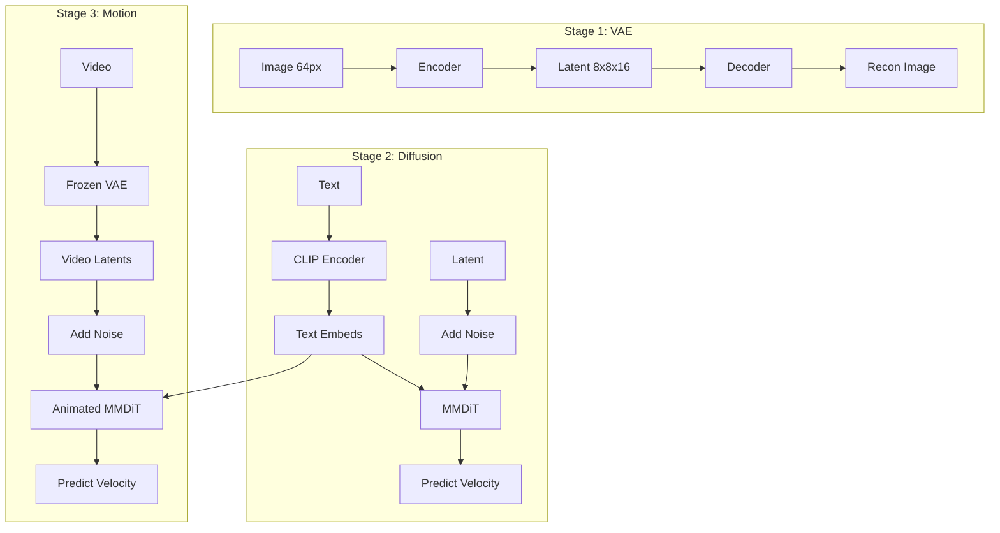

# tiny-stable-diffusion

> **Stable Diffusion 3 from Scratch** - A minimal educational implementation

  

## ⚡ TL;DR

A **200M parameter** implementation of Stable Diffusion 3 (SD3) trained on consumer GPUs.
It uses **Rectified Flow** and **MMDiT** architecture to generate **64×64 images and GIFs**.

**Quick Start:**
```bash
# 1. Setup
bash setup.sh

# 2. Train VAE -> Diffusion -> Motion (Optional)
uv run main.py --train-vae
uv run main.py --train-diffusion
uv run main.py --train-motion

# 3. Generate
uv run main.py --generate --prompt "a cute cat"
uv run main.py --generate-gif --prompt "a cat walking"
```

---

## Introduction

A lightweight, educational implementation of **Stable Diffusion 3** built from scratch in PyTorch. This project is designed to help you understand how modern text-to-image diffusion models work by providing a minimal yet complete implementation.

### Key Features

- **64×64 Resolution**: Optimized for fast training and experimentation on consumer GPUs
- **SD3 Architecture**: Implements the core components of Stable Diffusion 3
  - **VAE**: AutoencoderKL with f8 compression (16 latent channels)
  - **MMDiT**: Multi-Modal Diffusion Transformer with Joint Attention
  - **Rectified Flow**: Linear interpolation based diffusion training
- **GIF Generation**: Extension using a **Motion Module** (AnimateDiff style) for consistent animations
- **Three-Stage Training**: VAE -> Diffusion -> Motion Module
- **Beginner-Friendly**: Clean, readable code with minimal dependencies

---

## Overall Pipeline

The system works in three distinct stages, mirroring the standard Latent Diffusion Model (LDM) approach with temporal extensions.

### 1. Training Pipeline



### 2. Inference Pipeline

```
Image: Prompt ──► CLIP ──► MMDiT ──► VAE Decoder ──► Image
GIF:   Prompt ──► CLIP ──► Animated MMDiT ──► VAE Decoder ──► GIF
```

---

## Usage

### 1. Environment Setup

See `setup.sh` for detailed setup instructions.

```bash
# Quick setup
bash setup.sh
```

### 2. Inference

#### Image Generation

Generate images from text prompts:

```bash
uv run main.py --generate --prompt "a cute cat" --steps 50 --guidance 7.5
```

#### GIF Generation

Generate 16-frame animations from text prompts:

```bash
uv run main.py --generate-gif --prompt "a cat walking" --frames 16 --fps 8
```

### 3. Training

```bash
./scripts/train-vae.sh       # Stage 1
./scripts/train-diffusion.sh # Stage 2
./scripts/train-motion.sh    # Stage 3 (GIF extension)
```

---

## Model Architecture Details

| Component | Parameters | Description |
|-----------|------------|-------------|
| **VAE** | ~21M | **AutoencoderKL**: Compresses 64×64 images to 8×8×16 latents. |
| **MMDiT** | ~187M (Base) | **Multi-Modal DiT**: Uses Joint Attention for text and image tokens. |
| **Motion Module**| ~50M | **Temporal Attention**: Injected layers for frame consistency. |
| **CLIP** | 123M | **Text Encoder**: Frozen CLIP ViT-B/32 model. |

**Comparison with SD3:**

| Feature | Stable Diffusion 3 | tiny-stable-diffusion |
|---|---|---|
| **Resolution** | 1024×1024 | 64×64 |
| **Latent Channels** | 16 | 16 |
| **Model Size** | 2B+ | ~200M |
| **Training Cost** | Massive Cluster | Consumer GPU |

For detailed documentation, check the `docs/` folder:
- [**VAE Architecture**](docs/models/VAE.md)
- [**MMDiT Architecture**](docs/models/MMDiT.md)
- [**Diffusion Process**](docs/models/Diffusion.md)

---

## Configuration

All settings in `config.yaml`:

```yaml
# Key settings
vae_train:
    dataset_name: hmu013/LAION-300k
    epochs: 100
    batch_size: 256

diffusion_train:
    dataset_name: visual-layer/oxford-iiit-pet-vl-enriched
    model_type: mmdit  # or "dit"
    model_size: B      # S, B, L, XL
    epochs: 200
    batch_size: 64
```

---

## Project Structure

```
tiny-stable-diffusion/
├── main.py              # CLI entry point
├── config.yaml          # Configuration
├── src/
│   ├── models/          # VAE, DiT, Diffusion
│   ├── training/        # Training loops
│   ├── inference/       # Generation
│   └── demo/            # Streamlit app
├── checkpoints/         # Saved models
├── docs/                # Documentation
└── samples/             # Generated images
```

---

## Extensions / Roadmap

We are actively working on extending `tiny-stable-diffusion` with new capabilities.

### 🎥 Motion Module (GIF Generation) - *In Progress*

We are implementing a **Motion Module** to generate GIFs and short animations using the existing pre-trained models. This is inspired by [AnimateDiff](https://arxiv.org/abs/2307.04725).

- **Goal**: Generate consistent 16-frame animations from text prompts.
- **Approach**: Inject temporal attention layers into the frozen MMDiT backbone.
- **Status**: Core modules and data pipeline implemented. Training loop in progress.
- **Documentation**: [docs/extensions/MotionModule.md](docs/extensions/MotionModule.md)

---

## References

- [Stable Diffusion 3](https://arxiv.org/abs/2403.03206) - Rectified Flow Transformers
- [DiT](https://arxiv.org/abs/2212.09748) - Diffusion Transformers
- [DDPM](https://arxiv.org/abs/2006.11239) / [DDIM](https://arxiv.org/abs/2010.02502) - Diffusion Models

---

## License

MIT License
