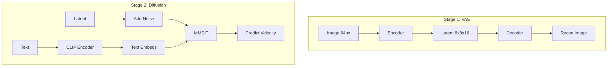
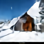
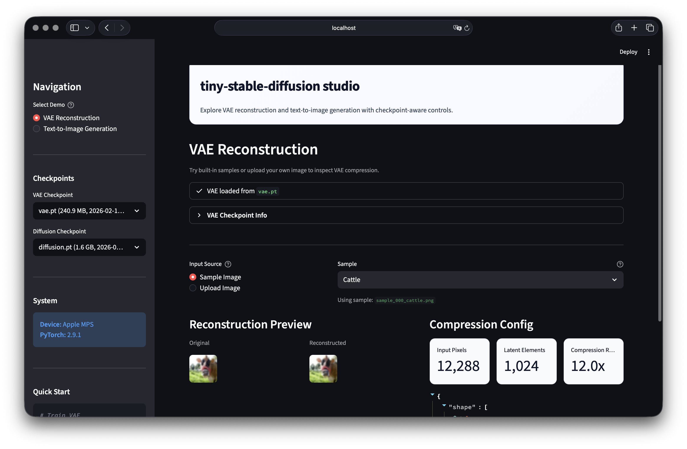
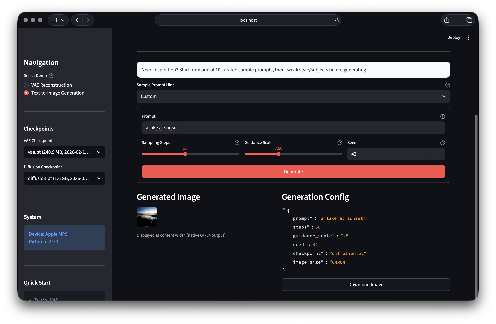

# tiny-stable-diffusion

> **Stable Diffusion 3 from Scratch** - A minimal educational implementation

  

## ⚡ TL;DR

A **200M parameter** implementation of Stable Diffusion 3 (SD3) trained on consumer GPUs.
It uses **Rectified Flow** and **MMDiT** architecture to generate **64×64 images**.

**Quick Start:**
```bash
# 1. Setup
bash scripts/setup.sh

# 2. Train VAE -> Diffusion
uv run main.py --train-vae
uv run main.py --train-diffusion

# 3. Generate
uv run main.py --generate --prompt "a cute cat"
```

---

## Introduction

A lightweight, educational implementation of **Stable Diffusion 3** built from scratch in PyTorch. This project is designed to help you understand how modern text-to-image diffusion models work by providing a minimal yet complete implementation.

### Key Features

- **64×64 Resolution**: Optimized for fast training and experimentation on consumer GPUs
- **SD3 Architecture**: Implements the core components of Stable Diffusion 3
  - **VAE**: AutoencoderKL with f8 compression (16 latent channels)
  - **MMDiT**: Multi-Modal Diffusion Transformer with Joint Attention
  - **Rectified Flow**: Linear interpolation based diffusion training
- **Two-Stage Training**: VAE -> Diffusion
- **Beginner-Friendly**: Clean, readable code with minimal dependencies

---

## Overall Pipeline

The system works in two distinct stages, mirroring the standard Latent Diffusion Model (LDM) approach.

### 1. Training Pipeline



### 2. Inference Pipeline

```
Image: Prompt ──► CLIP ──► MMDiT ──► VAE Decoder ──► Image
```

### 3. Sample Outputs (Prompt-Image Pairs)

Settings: `checkpoint=checkpoints/diffusion.pt (40 epochs)`, `steps=50`, `guidance=7.5`, `num_samples=1`

| Prompt | Image |
|---|---|
| `a fluffy orange cat on a sofa` |  |
| `a red sports car on a rainy street` |  |
| `a small cabin in snowy mountains` |  |
| `a sunflower field at sunset` |  |
| `a bowl of ramen on a wooden table` |  |
| `a futuristic city skyline at night` |  |
| `a corgi wearing sunglasses` |  |
| `a lighthouse by rough ocean waves` |  |
| `a watercolor painting of a tulip` |  |
| `an astronaut walking on the moon` |  |

### 4. Streamlit Demo Page

| Demo View | Screenshot |
|---|---|
| VAE tab |  |
| Diffusion tab |  |

---

## Usage

### 1. Environment Setup

See [`scripts/setup.sh`](scripts/setup.sh) for detailed setup instructions.
For all helper scripts, see [`scripts/README.md`](scripts/README.md).

```bash
# Quick setup
bash scripts/setup.sh
```

### 2. Model Weights

Pretrained checkpoints are available on Hugging Face:
- https://huggingface.co/junyeong-nero/tiny-sd-models

Download weights with `scripts/download_from_hub.py`:

```bash
# Download both VAE and diffusion checkpoints to ./checkpoints
uv run python scripts/download_from_hub.py \
  --repo-id junyeong-nero/tiny-sd-models \
  --model-type all
```

### 3. Inference

#### Image Generation

Generate images from text prompts:

```bash
uv run main.py --generate --prompt "a cute cat" --steps 50 --guidance 7.5
```

#### Inference Benchmark (M2 MacBook Air)

Measured on **Apple M2 MacBook Air** using `scripts/measure-inference.sh` (`device=mps`).

| Device | Steps | Batch | Repeats | Latency Mean (ms) | Speed (sec/img) | Peak Accel Mem (primary, MB) | Peak RAM (MB) | RAM Delta (MB) |
|---|---:|---:|---:|---:|---:|---:|---:|---:|
| MPS (M2 MacBook Air) | 10 | 1 | 2 | 1553.15 | 1.553 | 1504.99 | 119.36 | 81.38 |

Memory note: in MPS/CUDA runs, use `Peak Accel Mem` as the main inference memory metric. `RAM Delta` is only the additional process RAM during the measured interval.

For full profiling outputs and CPU comparison, see [`scripts/README.md`](scripts/README.md) and `results/benchmarks/inference_profile_mps.json`.

### 4. Training

```bash
./scripts/train-vae.sh       # Stage 1
./scripts/train-diffusion.sh # Stage 2
```

More script usage: [`scripts/README.md`](scripts/README.md)

---

## Model Architecture Details

| Component | Parameters | Description |
|-----------|------------|-------------|
| **VAE** | ~21M | **AutoencoderKL**: Compresses 64×64 images to 8×8×16 latents. |
| **MMDiT** | ~187M (Base) | **Multi-Modal DiT**: Uses Joint Attention for text and image tokens. |
| **CLIP** | 123M | **Text Encoder**: Frozen CLIP ViT-B/32 model. |

**Comparison with SD3:**

| Feature | Stable Diffusion 3 | tiny-stable-diffusion |
|---|---|---|
| **Resolution** | 1024×1024 | 64×64 |
| **Latent Channels** | 16 | 16 |
| **Model Size** | 2B+ | ~200M |
| **Training Cost** | Massive Cluster | Consumer GPU |

For detailed documentation, check the `docs/` folder:
- [**VAE Architecture**](docs/models/VAE.md)
- [**MMDiT Architecture**](docs/models/MMDiT.md)
- [**Diffusion Process**](docs/models/Diffusion.md)

---

## Configuration

All settings in `config.yaml`:

```yaml
# Key settings
vae_train:
    dataset_name: hmu013/LAION-300k
    epochs: 100
    batch_size: 256

diffusion_train:
    dataset_name: visual-layer/oxford-iiit-pet-vl-enriched
    model_type: mmdit  # or "dit"
    model_size: B      # S, B, L, XL
    epochs: 200
    batch_size: 64
```

---

## Project Structure

```
tiny-stable-diffusion/
├── main.py              # CLI entry point
├── config.yaml          # Configuration
├── src/
│   ├── models/          # VAE, DiT, Diffusion
│   ├── training/        # Training loops
│   ├── inference/       # Generation
│   └── demo/            # Streamlit app
├── checkpoints/         # Saved models
├── docs/                # Documentation
└── results/             # Generated images and evaluation outputs
```

---

## References

- [Stable Diffusion 3](https://arxiv.org/abs/2403.03206) - Rectified Flow Transformers
- [DiT](https://arxiv.org/abs/2212.09748) - Diffusion Transformers
- [DDPM](https://arxiv.org/abs/2006.11239) / [DDIM](https://arxiv.org/abs/2010.02502) - Diffusion Models

---

## License

MIT License
