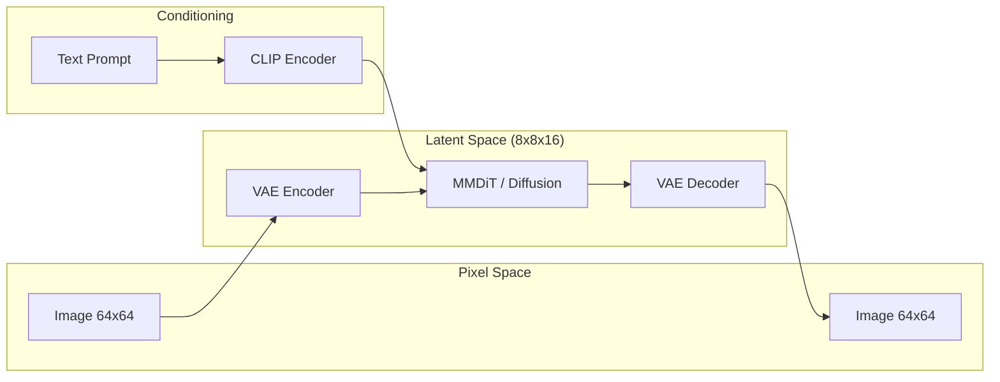

# Architecture Overview

> This document provides a high-level overview of the `tiny-stable-diffusion` architecture. For detailed component specifications, please refer to the specific model documents.

---

## 🏗 System Overview

`tiny-stable-diffusion` is an educational implementation of the **Stable Diffusion 3** architecture. It operates as a **Latent Diffusion Model (LDM)**, meaning it performs the computationally expensive diffusion process in a compressed latent space rather than directly on pixel values.

### Core Pipeline

The system consists of three primary components working in tandem:

1.  **VAE (Variational AutoEncoder)**: Compresses $64 \times 64$ images into $8 \times 8 \times 16$ latents and reconstructs them back to pixels.
2.  **CLIP Text Encoder**: Converts natural language prompts into high-dimensional embeddings that the diffusion model can understand.
3.  **MMDiT (Multi-Modal Diffusion Transformer)**: The "brain" of the system that learns to reverse the noise process in the latent space, conditioned on text embeddings.

### Architecture Diagram

---

## 🧩 Key Components

| Component | Role | Detailed Doc |
| :--- | :--- | :--- |
| **VAE** | Image compression and reconstruction (f8 factor) | [models/VAE.md](./models/VAE.md) |
| **MMDiT** | Joint Attention-based Transformer for denoising | [models/MMDiT.md](./models/MMDiT.md) |
| **Diffusion** | Rectified Flow-based iterative denoising process | [models/Diffusion.md](./models/Diffusion.md) |
| **CLIP** | Pre-trained text understanding (Frozen ViT-B/32) | `src/text_encoder/` |

---

## 🔄 Data Flow

### 1. Training (Stage 2: Diffusion)
*   **Input**: Real image $x$ and corresponding text $y$.
*   **Encoding**: $x$ is encoded to latent $z$ via VAE. $y$ is encoded to embedding $c$ via CLIP.
*   **Noising**: Random noise $\epsilon$ is added to $z$ based on timestep $t$ using Rectified Flow (linear interpolation).
*   **Prediction**: MMDiT predicts the **velocity** $v$ required to move from noise back to the clean latent.
*   **Loss**: Mean Squared Error (MSE) between predicted velocity and target velocity.

### 2. Inference (Generation)
*   **Input**: Text prompt.
*   **Encoding**: Prompt $\rightarrow$ CLIP embedding $c$.
*   **Initialization**: Start with pure Gaussian noise $z_T$ in latent space.
*   **Denoising**: Iteratively update $z$ using the Euler ODE solver for $N$ steps (default 50).
*   **Decoding**: The final clean latent $z_0$ is passed through the VAE Decoder to produce the $64 \times 64$ RGB image.

---

## 📊 Summary of Parameters

Depending on the configuration, the model size varies primarily based on the MMDiT backbone:

| Config | MMDiT Params | Total System Params* |
| :--- | :--- | :--- |
| **Small (S)** | ~87M | ~231M |
| **Base (B)** | ~187M | ~331M |
| **Large (L)** | ~559M | ~703M |

*\*Total includes VAE (~21M) and CLIP (~123M).*

---

## 📚 References

- [Stable Diffusion 3 (SD3)](https://arxiv.org/abs/2403.03206) - Primary inspiration.
- [DiT](https://arxiv.org/abs/2212.09748) - Baseline for Diffusion Transformers.
- [Rectified Flow](https://arxiv.org/abs/2209.03003) - The mathematical foundation for the diffusion process.