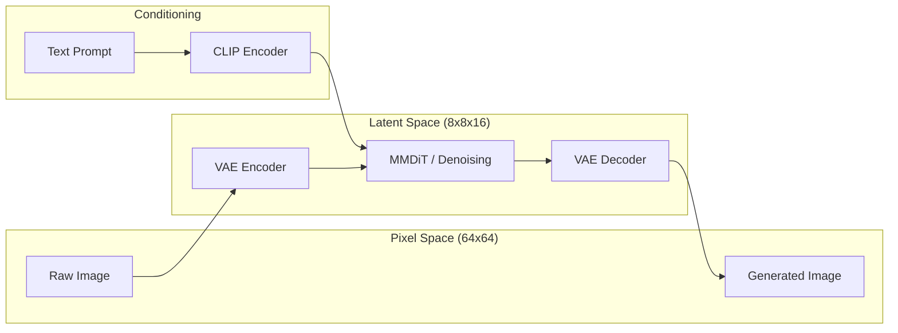

# 🏗 Architecture Overview

> A high-level technical blueprint of the `tiny-stable-diffusion` system. Learn how we bridge pixel space and latent space using modern SD3 principles.

---

## 🏛 System Philosophy

`tiny-stable-diffusion` is an educational implementation of the **Stable Diffusion 3** architecture. It operates as a **Latent Diffusion Model (LDM)**, shifting the computationally expensive diffusion process from high-dimensional pixel space to a compressed, efficient latent space.

### The Core Pipeline

The system integrates three primary neural components:

1.  **VAE (Variational AutoEncoder)**: The "Bridge". Compresses $64 \times 64$ RGB images into $8 \times 8 \times 16$ latents and reconstructs them back.
2.  **CLIP Text Encoder**: The "Translator". Converts natural language prompts into semantic embeddings that guide the generation process.
3.  **MMDiT (Multi-Modal Diffusion Transformer)**: The "Brain". A joint-attention backbone that learns to reverse the Rectified Flow noise process in latent space.

### High-Level Data Flow

---

## 🧩 Component Specifications

| Component | Architecture | Role | Reference |
| :--- | :--- | :--- | :--- |
| **VAE** | AutoencoderKL (f8) | Latent compression & RGB reconstruction | [VAE Doc](./models/VAE.md) |
| **MMDiT** | Joint-Attention Transformer | Text-conditioned iterative denoising | [MMDiT Doc](./models/MMDiT.md) |
| **Diffusion** | Rectified Flow (Linear) | Mathematical framework for noise transport | [Diffusion Doc](./models/Diffusion.md) |
| **CLIP** | ViT-B/32 (Frozen) | Multi-modal text understanding | `src/text_encoder/` |

---

## 🔄 Operation Modes

### 1. Training Phase (Stage 2: Diffusion)
*   **Encoding**: Image $x \rightarrow$ Latent $z$ via VAE; Text $y \rightarrow$ Embedding $c$ via CLIP.
*   **Perturbation**: Create noisy latent $z_t$ using linear interpolation: $z_t = (1-t)z_0 + t\epsilon$.
*   **Learning**: MMDiT predicts the **velocity vector** $v$ that points from noise to data.
*   **Objective**: Minimize Mean Squared Error (MSE) between predicted and target velocity.

### 2. Inference Phase (Generation)
*   **Initialization**: Sample pure Gaussian noise $z_1 \sim \mathcal{N}(0, I)$ in $8 \times 8 \times 16$ space.
*   **Denoising**: Use an ODE solver (Euler) to follow the predicted velocity field over $N$ steps.
*   **Guidance**: Apply **Classifier-Free Guidance (CFG)** to amplify the influence of the text prompt.
*   **Rendering**: The final latent $z_0$ is decoded by the VAE into a $64 \times 64$ RGB image.

---

## 📊 Scalability Options

The architecture is designed to scale according to the **MMDiT** backbone size:

| Config | Backbone Params | Total System Params* | Target Hardware |
| :--- | :--- | :--- | :--- |
| **Small (S)** | ~87M | ~231M | Laptop / Colab Free |
| **Base (B)** | ~187M | ~331M | Consumer GPU (8GB+) |
| **Large (L)** | ~559M | ~703M | Prosumer GPU (24GB+) |

*\*Total includes VAE (~21M) and CLIP (~123M).*

---

## 📚 References
- [Stable Diffusion 3 Paper](https://arxiv.org/abs/2403.03206)
- [DiT (Diffusion Transformers)](https://arxiv.org/abs/2212.09748)
- [Rectified Flow Foundations](https://arxiv.org/abs/2209.03003)
